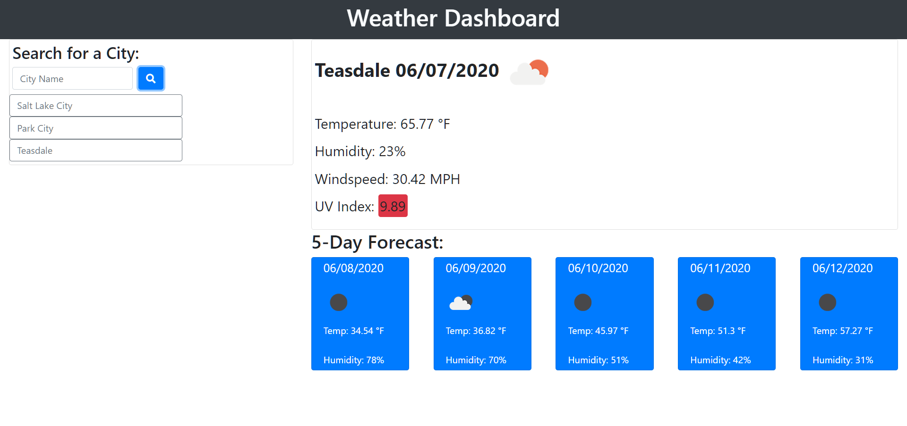

# Weather Dashboard

https://tremigi.github.io/weather-dashboard

The weather dashboard is a school project completed created by Taylor Remigi. It allows a user to search the weather by city name, and returns information for the current temperature, windspeed, humidity, and uv index. Additionally, users can view the temperature and humidity levels for the next five days for the city they are currently viewing.

Past search history is saved in dynamically updated buttons under the search bar, and will pull appropriate weather data upon being clicked.

The styling utilizes the bootstrap framework and updates element size, display, and positioning based on device screen size.

Please see repository issues page for future features, refactors, and bug fixes.

## Installation

No installation required.

## Languages and Libraries Used

HTML, CSS, Bootstrap, JavaScript, jQuery, and moment.js were used to create this application. It also features the <a href="https://openweathermap.org/api">Open Weather API</a> for fetching weather data.

## Contributing
Created by Taylor Remigi
